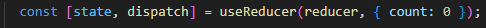

# useReducer
Powerful but underutilized. You could say it's like the useState hook with esteroids. To handle complex use of states.

## The problem
Sometimes you have to handle multiple components with multiple states. 

## The solution
This is an advanced alternative to ``useState``.

## A few concepts first
To show the value of this hook we will build a simple component that adds, substract and multiply numbers. It will have three buttons and we will use the ``useState`` hook only.

## Implementation
...
1. Import the ``useReducer`` from react.
2. In the base case we built the application using only ``useState`` hook.
3. In the Part II we replace our useState with ``useReducer`` hook. It has same format as ``useState`` but with soma differences. We will use a variable called ``state`` and a function that we will call ``dispatch``. As arguments we will use a function that we'll call ``reducer`` and an initial value for our function. We will pass this as an object with a variable ``count`` and initial value 0.

4. Now we need to create the ``reducer`` function outside the ``ReducerExample`` component. This function will take two elements: a variable we'll call ``state`` (which is like a placeholder for the state of the hook) and an ``action``.
5. You can now 'dispatch' actions.

## Advance use of useReducer

[Home](/README.md)