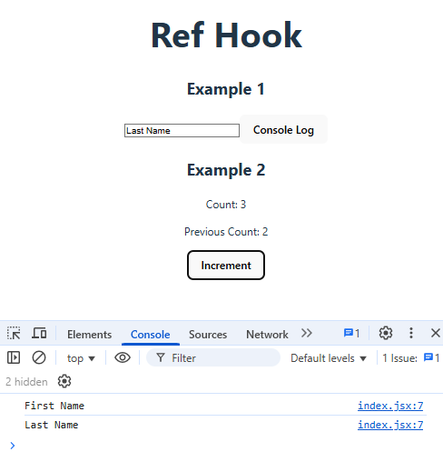

# useRef
A hook that could be use for submissions in a form. Although you could do this with useState, this hook useRef is much efficient.

## The problem
How to keep an historical or specific value or state. In other words, In cases where you want to preserve (persist) a value in a component regardless of the render of the component. Also when you don't want the componet to re-render whenever the value changes. This is the case when filling and submitting forms.

When submitting a form i.e. a user/password, you don't need to store the information everytime the state changes i.e. at every keystroke while entering the information. Instead of storing the partial information in ``state`` you want to store the inputs and preserve it until the moment of hitting submission.

## The solution
Use this hook to have a value of the variable inmediately and not when the component is re-rendered (as with useState)

## A few concepts first
...
## Implementation
1. Import the ``useRef`` from react.
2. As Example 1 we build an input box to send the state to the console:
3. As Example 2 we create 2 counters but one is displaying the value captured directly with the Ref hook (Previous Count). The other (Count) displays the state from useState. 

## Advance use of useReducer

[Home](/README.md)